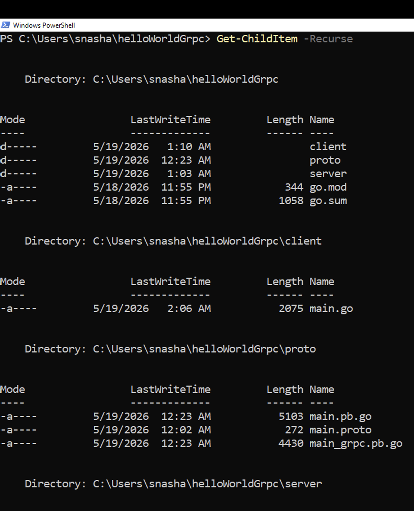
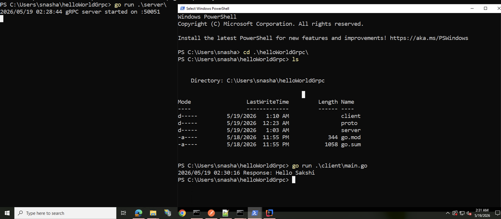

# gRPC Hello World in Go

## What are we trying to do?

This repository contains a simple gRPC demonstration project to help get started with gRPC in Golang.

It includes:
- Proto definitions
- gRPC server (handler + bootstrap separation)
- gRPC client
- End-to-end RPC call example

---

## Setting up the project

### Create project folder

```bash
mkdir helloWorldGrpc
cd helloWorldGrpc
```
---

### Initialize Go module

```bash
go mod init helloWorldGrpc
go version
```

---

## Install dependencies

```bash
go get google.golang.org/grpc
go get google.golang.org/protobuf
```

---

## Install protoc plugins

```bash
go install google.golang.org/protobuf/cmd/protoc-gen-go@latest
go install google.golang.org/grpc/cmd/protoc-gen-go-grpc@latest
```

Check version:

```bash
protoc --version
```

---

## Proto file
Copy from the proto folder in the same repo
---

## Generate Go code

```bash
protoc --go_out=. --go_opt=paths=source_relative \
--go-grpc_out=. --go-grpc_opt=paths=source_relative \
proto/main.proto
```

Generated files:

* main.pb.go → request/response structs
* main_grpc.pb.go → client & server interfaces

---

## Server structure

```
server/
├── handler.go
└── bootstrap.go
```

* handler.go → business logic (SayHello implementation)
* bootstrap.go → TCP + gRPC server startup

---
## Final Folder structure:


--- 
## Run server

```bash
go run .\server\
```

---

## Client

Client uses generated gRPC stub to call server.

---

## Run client

```bash
go run .\client\main.go
```


---

## How it works ?
First, you start the server using go run server/bootstrap.go. This opens a TCP port (:50051) using net.Listen, then creates a gRPC server instance and registers your HelloServer implementation. At this point, the server is “live” and waiting — but nothing is executed yet. The SayHello handler is NOT called during startup.
Then you run the client (go run client/main.go). The client creates a TCP connection to localhost:50051 using gRPC, builds a client stub from generated proto code, and prepares a request. When client.SayHello(...) is executed, that is the exact moment the RPC call is triggered: the request is serialized using protobuf, sent over HTTP/2 on top of the TCP connection, and travels to the server.
On the server side, gRPC receives this request, matches it to the registered service (HelloService), and then invokes your actual handler method: SayHello(ctx, req). This is where your business logic runs. The handler returns a response, gRPC serializes it again, sends it back over the same connection, and the client receives and deserializes it into HelloResponse.

---

## Overall flow
Client → RPC Call → gRPC Server → Handler → Response → Client
