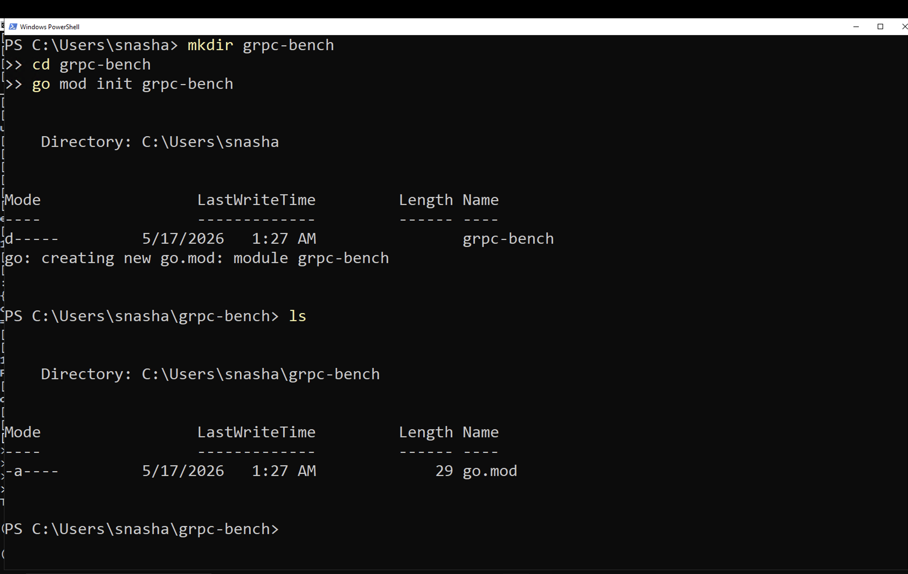
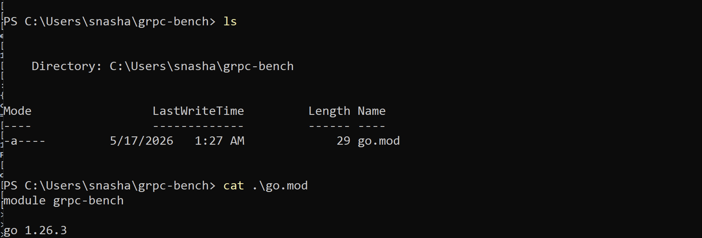
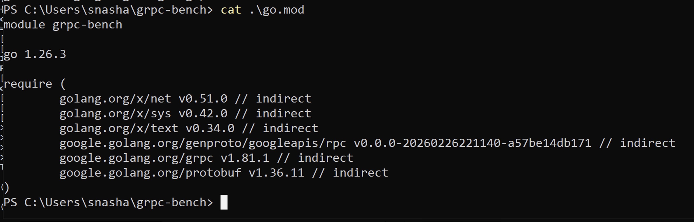
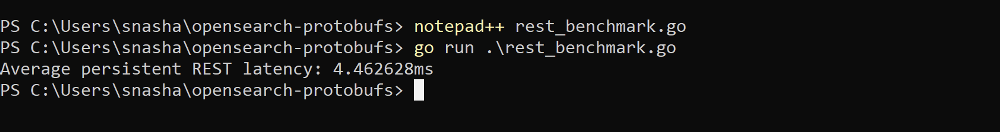
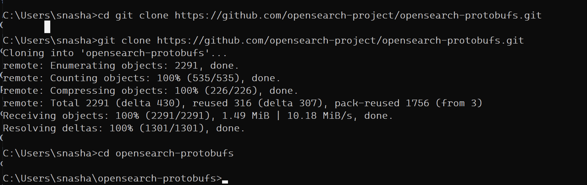
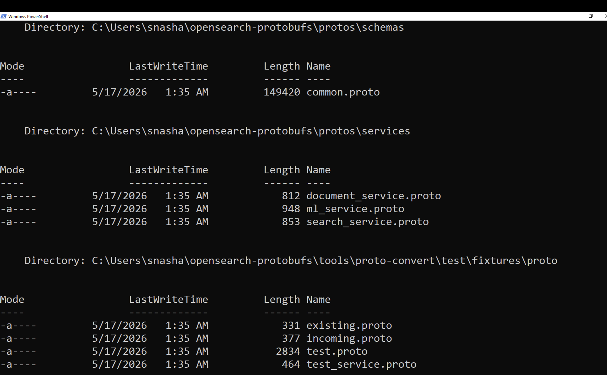
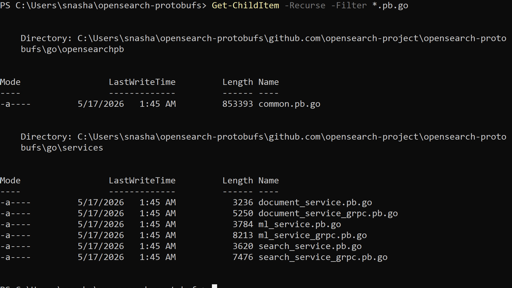
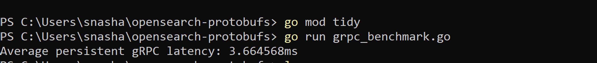

# OpenSearch gRPC Persistent Benchmark (Go)

This benchmark compares **persistent REST vs persistent gRPC** search performance in OpenSearch using identical search workloads.

## Objective

Measure real transport and serialization performance differences between:

- Persistent REST (HTTP/JSON)
- Persistent gRPC (HTTP/2 + Protobuf)

### Search workload used for both:
- Index: `perf-test`
- Query: `title:OpenSearch`

---

# Environment Verification

## Check Go version

```powershell
go version
```

### OUTPUT:
I am using go version go1.26.3 windows/amd64
---

# Step 1: Create Benchmark Workspace

```powershell
mkdir grpc-bench
cd grpc-bench
go mod init grpc-bench
ls
```

### OUTPUT:


---

# Step 2: Install Dependencies

```powershell
go get google.golang.org/grpc
go get google.golang.org/protobuf
```

### Before `go get`:



### After `go get`:



---

# Step 3: Persistent REST Benchmark
GitHub file:

- `rest_benchmark.go`

Run:

```powershell
go run .\rest_benchmark.go
```

### OUTPUT:



---

# Step 4: Persistent gRPC Benchmark

## Clone OpenSearch Protobuf Definitions

```powershell
git clone https://github.com/opensearch-project/opensearch-protobufs.git
cd opensearch-protobufs
```

### OUTPUT:



---

## Install `protoc`

Download:  
https://github.com/protocolbuffers/protobuf/releases

Add to PATH:

```powershell
$env:Path += ";C:\Users\snasha\Downloads\protoc-35.0-rc-2-win64\bin"
```

Verify:

```powershell
protoc --version
```

Expected:

```powershell
libprotoc 35.0-rc2
```  
---

## Generate Go gRPC Client Bindings

```powershell
protoc `
  --proto_path=. `
  --go_out=. `
  --go-grpc_out=. `
  protos\schemas\common.proto `
  protos\services\search_service.proto `
  protos\services\document_service.proto `
  protos\services\ml_service.proto
```
## Verify Generated Files

### Before:



### After:



---

# Step 5: Initialize Go Module for gRPC Benchmark

```powershell
go mod init grpc-benchmark
go mod tidy
```

---

# Step 6: Run Persistent gRPC Benchmark

GitHub file:

- `grpc_benchmark.go`

Run:

```powershell
go run grpc_benchmark.go
```

### OUTPUT:



Note: in the code we have 
conn, err := grpc.NewClient( "localhost:9400", grpc.WithTransportCredentials(insecure.NewCredentials()), )
Meaning : OpenSearch is running a gRPC server on port 9400
Don’t use TLS encryption , insecure.NewCredentials() = plaintext gRPC
This is good for local dev / benchmarks, but not atall practiced in Prod

Equivalent idea:
HTTP vs HTTPS difference
gRPC insecure vs gRPC TLS
---

# Final Benchmark Results

| Method | Avg Latency |
|--------|--------------|
| Persistent Go REST | ~4.46 ms |
| Persistent Go gRPC | ~3.66 ms |

---

# Improvement

## ~18–22% lower latency with gRPC

---

# Interpretation

## gRPC Advantages

- Protobuf serialization
- HTTP/2 persistent multiplexed connections
- Lower payload size
- Reduced parsing overhead
- Better throughput under scale

---

## REST Advantages

- Easier ecosystem integration
- Human-readable JSON
- Broad tooling compatibility
- Simpler debugging

---

# Key Takeaway

For production-scale OpenSearch workloads:

## gRPC reduces transport overhead significantly while preserving identical query behavior.

Even small per-request savings multiply dramatically at scale.
