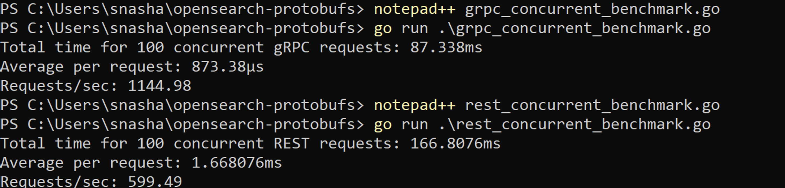

# OpenSearch Concurrent Benchmark (Go)

This benchmark compares **persistent concurrent REST vs persistent concurrent gRPC** performance under production-style parallel workloads.

## Objective

Measure how REST and gRPC behave under simultaneous request pressure using:

- Persistent REST (HTTP/JSON)
- Persistent gRPC (HTTP/2 + Protobuf)

### Shared Search Workload:
- Index: `perf-test`
- Query: `title:OpenSearch`
- Concurrent Requests: `100 simultaneous requests`

---

# Benchmark Scripts

## REST Concurrent Benchmark
- `rest_concurrent_benchmark.go`

## gRPC Concurrent Benchmark
- `grpc_concurrent_benchmark.go`

---

# Methodology

Both benchmarks:

- Reused persistent client connections
- Executed identical search requests
- Simulated 100 parallel concurrent requests
- Measured:
  - Total execution time
  - Average request latency
  - Throughput (requests/sec)

---

# Execution

## Run REST Concurrent Benchmark

```powershell
go run .\rest_concurrent_benchmark.go
```

---

## Run gRPC Concurrent Benchmark

```powershell
go run .\grpc_concurrent_benchmark.go
```

---

# Output



---

# Concurrent Benchmark Results (100 Simultaneous Requests)

| Method | Total Time | Avg/Request | Throughput |
|--------|-------------|--------------|------------|
| REST | 166.8 ms | 1.67 ms | ~599 req/sec |
| gRPC | 87.3 ms | 0.87 ms | ~1145 req/sec |

---

# Performance Gain

## Latency Improvement

### gRPC is approximately **48% faster**

- REST: **1.67 ms**
- gRPC: **0.87 ms**

---

## Throughput Improvement

### gRPC handles approximately **91% more requests/sec**

- REST: **~599 req/sec**
- gRPC: **~1145 req/sec**

---

# Interpretation

## Under concurrency, gRPC’s advantages become significantly clearer:

- HTTP/2 multiplexing
- Binary protobuf serialization
- Lower payload overhead
- Better persistent connection efficiency
- Reduced thread and request management overhead

---

# Comparative Performance Summary

## Single Request Benchmark:
### ~18–22% gain

---

## Concurrent Workload Benchmark:
### ~48–90% gain

---

# Key Takeaway

As concurrency increases:

## gRPC’s transport and serialization efficiencies compound significantly.

This makes gRPC especially compelling for:

- high-throughput search systems
- microservices
- distributed architectures
- sustained production workloads

---

# Disclaimer

> Benchmark values are environment-specific and may vary depending on:
>
> - dataset size
> - index structure
> - query complexity
> - document volume
> - machine hardware
> - CPU and memory load
> - OpenSearch build version
> - protobuf generation
> - JVM warmup
> - operating system networking stack
>
> These results are controlled experimental observations and should not be interpreted as universal production guarantees.

---

# Conclusion

This benchmark demonstrates:

## REST
- Strong baseline
- Broad compatibility
- Easier tooling

---

## gRPC
- Lower latency under scale
- Higher throughput
- Superior concurrency handling
- Better protocol efficiency

---

# Final Insight

> At production scale, small protocol inefficiencies multiply dramatically.

While naive benchmarks may obscure gRPC benefits, concurrent workloads reveal its true performance advantages.
